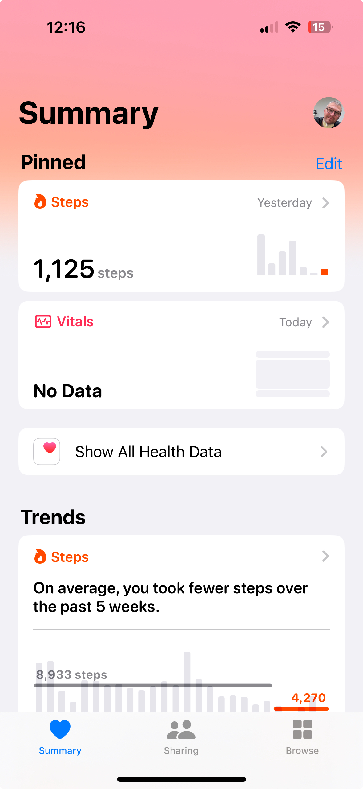
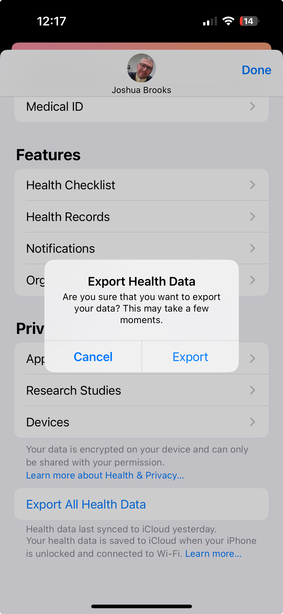

# applehealth


# Health Data Visualizer






## 🚀 Overview
This is a **browser-based Apple Health Data Visualizer** that allows users to:
- 📂 **Upload Apple Health XML files**
- 📊 **Convert XML → CSV**
- 📅 **Filter by Date & Health Data Type**
- 📈 **Generate Interactive Graphs (Plotly.js)**
- 💾 **Download Processed CSV**

Built with **HTML, JavaScript, Plotly.js, and PapaParse** – works **fully in the browser** (no backend needed)!

## 🌟 Features
✅ **XML to CSV Conversion (Client-Side)**  
✅ **Interactive Graphs with Plotly.js**  
✅ **Sort & Filter Data by Date**  
✅ **CSV Download Button**  
✅ **Works on GitHub Pages**  

## 🎯 How to Use
1. **Upload your Apple Health XML file.**
2. **Select a health data type** (Heart Rate, Steps, etc.).
3. **Adjust the date range** to filter your data.
4. **View interactive charts** with zoom & pan.
5. **Download your processed CSV file.**

## 🚀 Live Demo
🔗 **[Try it Here](https://jtb21091.github.io/applehealth/)**  

## 📸 Screenshot
  

## 🛠 Deployment (GitHub Pages)
1. Clone this repository:
   ```bash
   git clone https://github.com/jtb21091/applehealth.git
